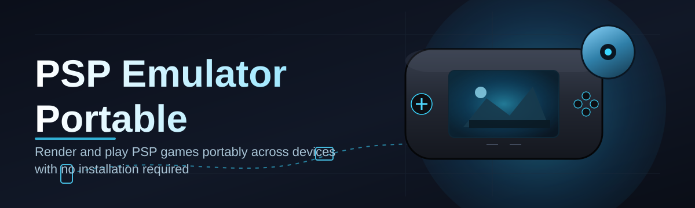

# psp-emulator-portable-manager 🎮💾

  

*One folder, zero installers, every PSP session exactly where you left it.*

  

## 🚀 Overview

Let's cut to it: **psp-emulator-portable-manager** is a portable session manager built around a single, stubborn idea — your PSP emulator setup shouldn't be scattered across `AppData`, registry keys, and three different config folders you forgot existed. This started as a weekend project because I was tired of re-mapping controller buttons every time I moved my emulator folder to a new drive. Now it's the thing I actually use every day, and apparently a lot of other people were annoyed by the same thing.

At its core, this tool wraps around your existing PSP emulator portable build and gives it a home — a self-contained directory that carries its configs, save states, memory stick images, and controller profiles as one unit. Plug in a USB drive, copy the folder, run it on a different machine, and everything just resumes. No registry entries left behind, no "where did my saves go" panic, no dependency hell.

This is built for the person who emulates PSP titles across multiple PCs, the retro-handheld tinkerer syncing between a desktop and a laptop, and anyone who just wants their PSP emulator portable environment to be genuinely portable — not "portable" in the loose marketing sense where it still writes to five system folders behind your back.

> [!NOTE]
> This project is a **manager and launcher wrapper**, not an emulator core itself. It orchestrates configs, profiles, and portable directory structure around your emulator of choice.

---

## 🧩 What This Thing Actually Does

  

- **Self-contained profile folders** — every emulator instance you manage gets its own isolated directory with configs, save states, and memory stick data bundled together. Move it, zip it, back it up — it travels as one unit.

- **Drive-agnostic path resolution** — no more broken save paths because you plugged your USB drive into a different port. The manager rewrites relative paths on launch so your PSP emulator portable setup boots correctly regardless of drive letter.

- **One-click profile switching** — swap between "story mode save," "speedrun testing," and "just messing around" profiles without touching a single config file by hand.

- **Controller profile memory** — button mappings stick to the profile, not the machine. Plug your gamepad into a friend's PC, load your profile, and your inputs are exactly how you left them.

- **Update-aware, not update-pushy** — the manager checks for newer portable builds of supported emulators but never auto-downloads anything without you clicking confirm.

- **Batch save-state backups** — snapshot every active profile's save data in one pass before you do something risky, like testing a sketchy homebrew build.

- **Lightweight launcher shell** — a single executable that sits quietly until you need it, then hands off cleanly to your emulator core.

- **Theming that doesn't get in the way** — dark, light, and a genuinely comfortable "OLED black" theme for late-night sessions.

> [!TIP]
> Keep your portable folder on an external SSD instead of a flash drive if you're managing multiple profiles with large memory stick images — load times on the manager UI itself improve noticeably.

---

## 🏁 How To Get Started

1. Visit the [project landing page](https://SandstoneSeekerHope.github.io/psp-emulator-portable-manager/) and grab the latest portable build.

2. Extract the downloaded folder anywhere — Desktop, USB drive, network share, doesn't matter.

3. Run `psp-emulator-portable-manager.exe`. First launch creates your default profile automatically.

4. Point it at your emulator core folder once, and you're done — every future launch remembers it.

That's the whole ritual. No install wizard, no "select components," no reboot prompt.

---

## 🖥️ System Requirements

| Requirement | Details |
|---|---|
| OS | Windows 10 (64-bit) or Windows 11 |
| Dependencies | None — fully self-contained, no runtime installs required |
| Disk space | ~150 MB for the manager, plus space for your profiles/saves |
| Permissions | Standard user account is fine; no admin rights needed |
| Storage type | HDD, SSD, or USB flash drive — all supported |

> [!IMPORTANT]
> This manager does **not** ship a PSP emulator core or any game files. You supply your own legally-owned emulator build and content; this tool organizes and launches it.

---

## ⚙️ How It Works

The architecture is deliberately boring, which is a compliment here:

1. **Scan** — on launch, the manager scans its own directory tree for existing profiles.
2. **Resolve** — relative paths get rewritten against the current drive/mount point.
3. **Load** — the selected profile's config, controller map, and save data get staged.
4. **Launch** — the manager hands off to your emulator core with the correct arguments.
5. **Sync back** — on close, any new save states get written back into the profile folder.

<strong>Why not just symlink everything instead?</strong>

Symlinks break the moment you move the folder to a machine that doesn't recognize the original path structure — which defeats the entire point of a *portable* PSP emulator setup. Relative path resolution at launch time is slower to write but far more resilient across drives, OS reinstalls, and machine swaps.

---

## 🩹 Common Pitfalls

**Q: My save states vanished after moving the folder to a new PC.**
A: Check that you moved the entire root folder, not just the emulator subfolder. Saves live inside the profile directory, not next to the executable.

**Q: The manager says "core not found" on launch.**
A: Re-point it at your emulator executable via Settings → Core Path. This happens most often after re-extracting a fresh emulator portable build into a new location.

**Q: Controller inputs reset every time I switch profiles.**
A: That's expected if the profile was created before controller mapping was saved — recreate the mapping once and it'll persist correctly from then on.

**Q: Windows SmartScreen flagged the executable.**
A: Common for unsigned indie portable tools. Click "More info" → "Run anyway." The binary is unsigned by choice, not by accident — code signing certificates are expensive for a solo weekend project.

**Q: Can I run two profiles simultaneously?**
A: Yes, each profile launch is fully isolated, so nothing stops you from running two instances side by side for comparison testing.

**Q: My antivirus quarantined a save backup ZIP.**
A: Some AV heuristics flag ZIPs containing `.bin` memory stick images as suspicious. It's a false positive — whitelist the manager's backup folder if this happens repeatedly.

---

## 🎨 UI / UX Details

- **Themes**: Light, Dark, and OLED Black — switch instantly from the title bar, no restart required.

- **Keyboard shortcuts**:

  | Shortcut | Action |
  |---|---|
  | `Ctrl + N` | Create new profile |
  | `Ctrl + L` | Launch selected profile |
  | `Ctrl + B` | Backup current profile's saves |
  | `Ctrl + ,` | Open Settings |
  | `F5` | Refresh profile list |

- **Settings panel** covers core path, default theme, backup frequency, and whether the manager should remember window size/position.

- The whole UI is intentionally single-window — no wizard-style multi-step dialogs. Everything's reachable in two clicks or fewer.

> [!WARNING]
> Renaming a profile folder manually from outside the app will break its path bindings. Always rename profiles from inside the manager's UI.

---

## 🤝 Contributing & Community

This began as one dev's weekend fix for a personal annoyance, and it's grown mostly through people filing genuinely useful issues. Contributions are welcome:

- Found a bug? Open an issue with your Windows version and repro steps.
- Got a feature idea that fits the "portable, no-nonsense" philosophy? PRs and discussions are both fine.
- Translations, theme tweaks, and documentation fixes are especially appreciated — not everything needs to be a code change.

> [!TIP]
> Before opening a feature request, check existing issues first — there's a decent chance someone already asked, and someone else probably already has an opinion about it.

No corporate roadmap here, no VC-backed pressure — just steady updates from someone who actually uses this tool daily.

---

## 📜 License

Released under the [MIT License](LICENSE), 2026. Use it, fork it, build on it — just keep the license notice intact.

---

## ⚠️ Disclaimer

This project is an independent, unofficial tool and is not affiliated with, endorsed by, or sponsored by Sony Interactive Entertainment or any official PSP hardware/software vendor. It does not distribute, host, or bundle any copyrighted game content, BIOS files, or proprietary firmware. Users are solely responsible for ensuring they own legal rights to any software or content used alongside this manager. Use responsibly and in accordance with your local laws regarding emulation.

